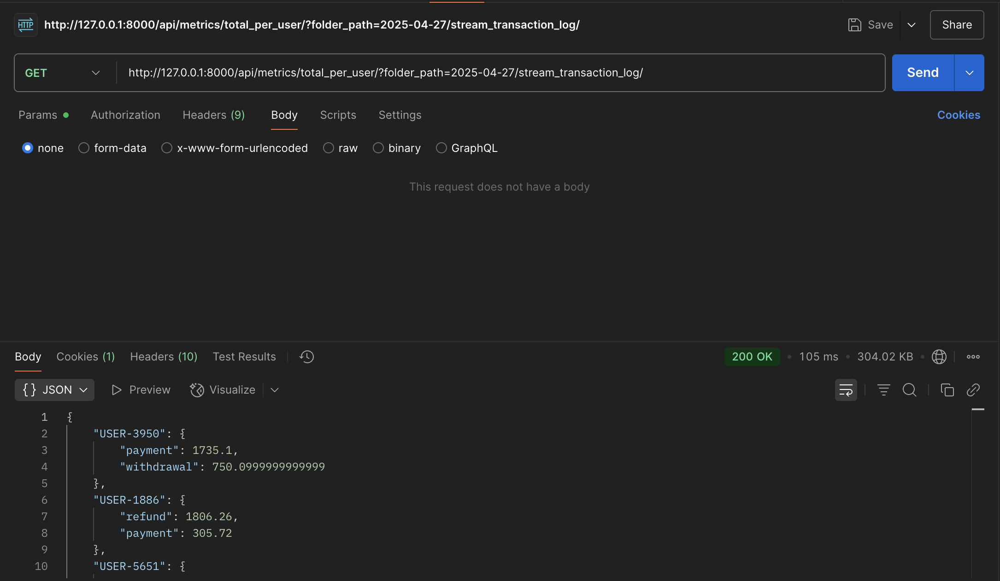

# Data Lake API Project

Ce projet est une API REST pour gérer les accès et les données dans un data lake, avec des fonctionnalités d’autorisation, de recherche, de statistiques, etc.

---

## Table des matières

- [Installation](#installation)  
- [Configuration](#configuration)  
- [Routes API](#routes-api)  
  - [Authentification](#authentification)  
  - [Permissions](#permissions)  
  - [Consultation des données](#consultation-des-données)  
  - [Statistiques](#statistiques)  
  - [Logs](#logs)  
  - [Réinjection Kafka](#réinjection-kafka)  
- [Utilisation avec Postman](#utilisation-avec-postman)  
- [Screenshots Postman](#screenshots-postman)  
- [Licence](#licence)

---

## Installation

1. Cloner le dépôt  

```git clone https://github.com/SPirate9/data_lake_project```

2. Installer les dépendances  

```pip install -r requirements.txt```

3. Configurer la base de données et le data lake  

4. Créer un superuser

```python manage.py createsuperuser```

4. Lancer le serveur Django  

```python manage.py runserver```

---

## Configuration

- Si besoin modifier les chemins `DATA_LAKE_PATH` et `DB_PATH` dans `settings.py` ou `views.py`  
- Configurer Kafka si besoin  
- Créer les migrations et migrer la base 
```
python manage.py makemigrations
python manage.py migrate
```
- Créer les utilisateurs Django pour accéder à l’API via l'UI Django accessible avec 
http://127.0.0.1:8000/admin/
---

## Routes API

### Authentification

- **POST** `/api/api-token-auth/`  
  Permet d’obtenir un token d’authentification via username/password.

### Permissions

- **POST** `/api/add_permission/`  
  Ajoute une permission d’accès à un utilisateur pour un dossier donné.  
  **Body JSON** : `{ "user_id": ..., "folder_path": "...", "access_level": "read" }`

- **DELETE** `/api/remove_permission/`  
  Supprime une permission.

### Consultation des données

- **GET** `/api/get_data_lake/`  
  Récupère les données filtrées et paginées d’un dossier du data lake.

- **GET** `/api/get_data_version/`  
  Récupère une version spécifique des données.

- **GET** `/api/list_resources/`  
  Liste les fichiers JSON disponibles.

- **GET** `/api/full_text_search/`  
  Recherche texte complet dans les fichiers JSON.

### Statistiques

- **GET** `/api/money_spent_last_5min/`  
  Montant dépensé dans les 5 dernières minutes.

- **GET** `/api/total_per_user/`  
  Montant total dépensé par utilisateur et type de transaction.

- **GET** `/api/top_x_products/`  
  Top X produits achetés.

### Logs

- **GET** `/api/access_logs/`  
  Affiche les logs d’accès.

### Réinjection Kafka

- **POST** `/api/repush_transaction/`  
  Réinjecte une transaction précise dans Kafka.

- **POST** `/api/repush_all_transactions/`  
  Réinjecte toutes les transactions d’un dossier.

---

## Utilisation avec Postman

Pour tester l’API, importer les requêtes suivantes dans Postman :  
- Configurer l’authentification Bearer Token avec le token obtenu via `/api/api-token-auth/`  
- Utiliser les routes mentionnées en remplissant les paramètres nécessaires (URL, body, query params).

---

## Screenshots Postman

### Authentification


---

### Ajouter une permission


---

### Supprimer une permission


---

### Récupérer des données


---

### Statistiques - Total dépensé par utilisateur



---


### Statistiques - Top produit


---

### Logs d’accès


---

### Réinjection Kafka


---

### Version


---

### Metrics last 5min

